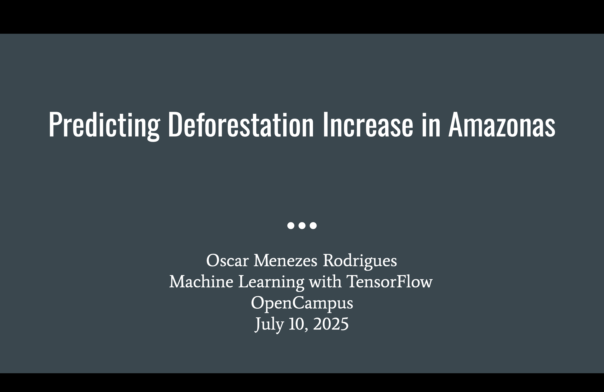

# [Amazon Deforestation Forecasting]

## Repository Link

[https://github.com/RodriguesOscar/deforestation-prediction]

## Description

This project focuses on predicting **deforestation increase** in the state of Amazonas, Brazil. Using land cover data from MapBiomas and annual deforestation data from PRODES, the goal is to build a machine learning model that identifies municipalities at higher risk of increased deforestation in the following year. The approach includes a baseline Logistic Regression model followed by a deep learning model with engineered features and custom loss functions to improve prediction accuracy and class separation.

### Task Type

Binary Classification

### Results Summary

- **Best Model:** Deep Neural Network with Focal Loss  
- **Evaluation Metric:** F1-Score  
- **Result:** F1-score of 0.77, ROC-AUC of 0.74, Accuracy of 68%

## Documentation

1. **[Literature Review](0_LiteratureReview/README.md)**
2. **[Dataset Characteristics](1_DatasetCharacteristics/exploratory_data_analysis.ipynb)**
3. **[Baseline Model](2_BaselineModel/baseline_model.ipynb)**
4. **[Model Definition and Evaluation](3_Model/1_final_model.ipynb)**
5. **[Presentation](4_Presentation/README.md)**

## Cover Image

